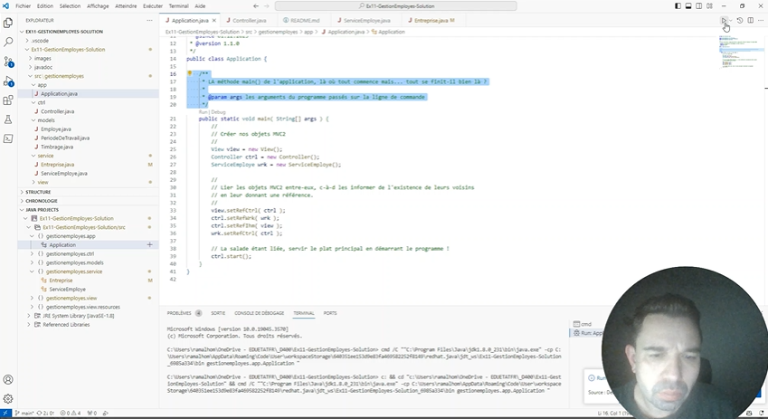

## Atelier du débogueur

Bienvenue sur l'atelier du débogueur. Cette activité sera réalisé en classe et sera structuré de la manière suivante :

## Les étapes

1. Débogagage d'une application identique avec enregistrement de l'écran et de son visage
2. Définir les tâches lors du débogage ensemble par toute la classe
3. Visualisation d'une vidéo d'exemple pour comprendre l'activité d'auto-confrontation
5. Auto-confrontation par groupe de 3 personnes
6. Définition d'un marche à suivre ensemble par toute la classe

### 1. Débogage d'une application

Ce projet contient une application MVC qui a été développé par un autre développeur. Il y a manifestement plusieurs problèmes dans l'application. On vous demande de corriger ces problèmes.

**Tâches à effectuer pendant le débogage** : Ouvrir l'application [Microsoft Stream](https://www.office.com/launch/Stream/) et réaliser un enregistrement d'écran. Enregistrez toutes vos actions effectués sur Visual Studio Code et n'oubliez pas d'activer la webcam pour que l'on puisse voir votre visage. Le son par contre n'est pas nécessaire. La longueur maximale de la vidéo est fixée par Stream à 15 min. Si vous n'avez pas réussi à corriger tous les problèmes durant les 15 min, vous pouvez vous arrêter là.
Ensuite, vous pouvez réaliser un commit/push de votre projet.

### 2. Définir les tâches lors du débogage
Durant cette étape, merci de lister dans le fichier [TACHES.md](TACHES.md), toutes les tâches que vosu devez réaliser lorque vous réaliser un débogage. Réalisez ceci de manière individuelle. Dès que vous avez terminé, vous pouvez réaliser un commit/push de votre projet.

### 3. Visualisation d'une vidéo d'exemple
Le professeur va vous montrer une vidéo d'exemple pour vous expliquer comment fonctionne l'auto-confrontation que vous allez réaliser à l'étape 4. L'objectif de cet étape est d'analyser de manière constructive la vidéo de votre collègue.

Lors de l'analyse de la vidéo de votre collègue, vous devez obligatoirment passer par les 3 points ci-dessous :

1. Descriptif : Vous devez décrire ce que la personne est en train de faire. Exemple : il ouvre l'outil "Exécuter et déboguer"  et clique sur le bouton "Exécuter et déboguer".
2. Interprétatif : Vous pouvez ensuite intérpréter les gestes de la personne. Exemple : Il exécute pas à pas le débogueur pour comprendre quel variable n'est pas correct.
3. Évaluatif : Vous pouvez ensuite évaluer certaines actions réalisé par la personne. Exemple : Il aurait pu directement ouvrir la classe service au lieu de chercher sur le contrôleur.

### 4. Auto-confrontation par groupe de 3 peronnnes
Lors de cette étape, vous pouvez vous mettre par groupe de 3. Chacun montre sa vidéo et les autres pouvent analyser la vidéo en passant par les 3 étapes décrites dans le point d'avant.

### 5. Définition d'une marche à suivre
Dans cette étape, vous constituer toute la classe une marche à suivre commune pour mieux déboguer vos futures programmes.

